# Flujo de Mensaje en Conversacion Larga

```mermaid
sequenceDiagram
    participant U as Usuario
    participant API as /api/chat
    participant SB as Supabase
    participant VPS as VPS Orchestrator

    U->>API: POST mensaje

    rect rgb(40, 60, 80)
        Note over API,VPS: Historial corto (< 4000 tokens)
        API->>SB: Carga mensajes (sin summary)
        SB-->>API: mensajes
        API->>VPS: prompt con historial normal
        VPS-->>API: respuesta
        API->>SB: guarda mensaje
        API-->>U: streaming SSE
    end

    rect rgb(80, 40, 40)
        Note over API,VPS: Historial largo (> 4000 tokens)
        API->>SB: Carga mensajes
        SB-->>API: mensajes
        API->>SB: Carga conversations.summary?
        SB-->>API: null (primera vez)

        API->>VPS: POST /api/summarize
        Note right of VPS: Claude genera resumen<br/>del historial completo
        VPS-->>API: { summary: "..." }

        API->>SB: UPDATE conversations<br/>SET summary = "..."
        API->>SB: Recorta a ultimos 10 mensajes

        API->>VPS: prompt con<br/>[Resumen] + [10 msgs frescos]
        VPS-->>API: respuesta + context_delta?
        API->>SB: Persiste notes si nuevo
        API-->>U: streaming SSE
    end

    rect rgb(40, 80, 40)
        Note over API,U: Context Delta (cumulative notes)
        VPS-->>API: { response: "...", context_delta: { add_notes: "..." } }
        API->>SB: UPDATE user_context<br/>custom_notes += new_note
    end
```



---

## Resumen de cada paso

### 1. Usuario envia mensaje
```json
{ "message": "...", "conversation_id": "uuid" }
```

### 2. Calculo de tokens
```
tokens = length(historial) / 4
```

### 3a. Si < 4000 tokens
- Carga historial normal
- Envia prompt standard al VPS

### 3b. Si > 4000 tokens
1. Llama `/api/summarize` en VPS
2. VPS usa Claude para resumir
3. Guarda resumen en `conversations.summary`
4. Recorta historial a 10 mensajes
5. Envia prompt con:
   - `[Resumen de conversacion anterior]`
   - `<resumen>`
   - `[Mensajes recientes]`
   - `<10 mensajes>`

### 4. Respuesta del VPS
```json
{
  "response": "texto de Claude",
  "topic": "...",
  "city": "...",
  "context_delta": {
    "add_notes": "Usuario tiene un Corolla 2015"
  }
}
```

### 5. Persistencia de notas
- Solo agrega si no existe duplicado
- Guarda en `user_context.custom_notes`

---

## Archivos involucrados

| Archivo | Que hace |
|---|---|
| `src/app/api/chat/route.ts` | Orchestrates todo el flujo |
| `VPS: src/orchestrator.ts` | Genera resumen + procesa prompts |
| `VPS: src/index.ts` | Expone `/api/summarize` |
| `Supabase: conversations.summary` | Almacena resumen |
| `Supabase: user_context.custom_notes` | Almacena notas acumulativas |